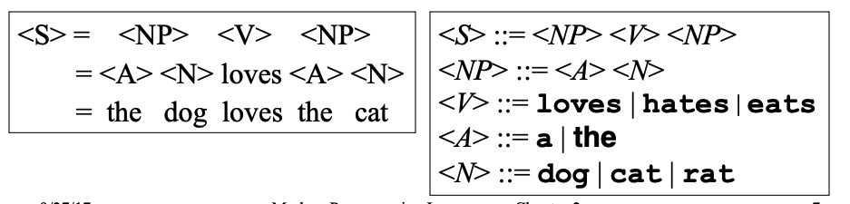
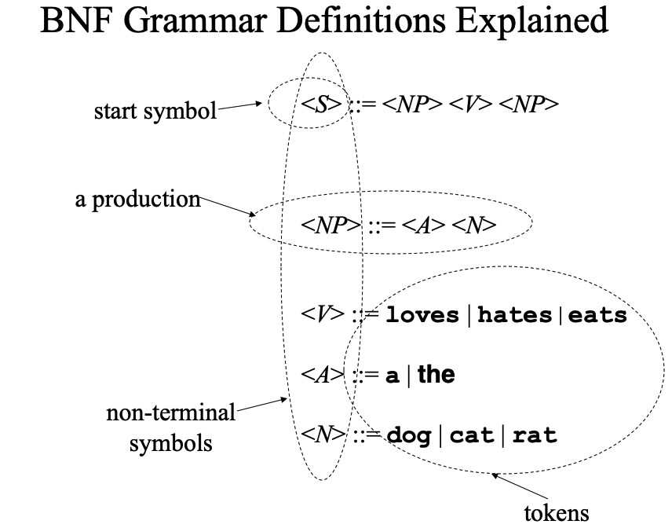
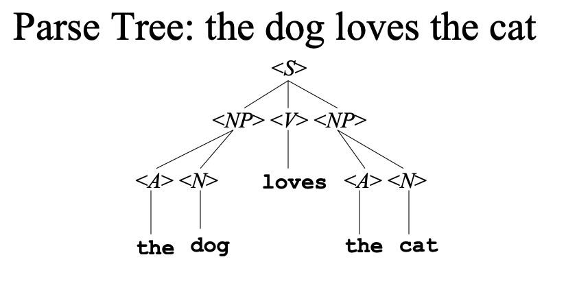

## Basics For Syntax and Grammar Rules:

### BNF Form Rules and Symbology

Backus Naur Form grammars consist of four parts:

The set of tokens
* The set of non-terminal symbols
* The start symbol
* The set of productions

**Example**

**Components**

**Parse-Tree Diagram**

### EBNF Variations

Additional syntax to simplify some grammar
chores:
* {x} or x* to mean zero or more repetitions of x
* x+ to mean one or more repetitions of x
* [x] to mean x is optional (i.e. x | <empty>)
* ( ) for grouping
* | anywhere to mean a choice among alternatives
* Quotes around tokens, if necessary, to distinguish from all these meta-symbols

